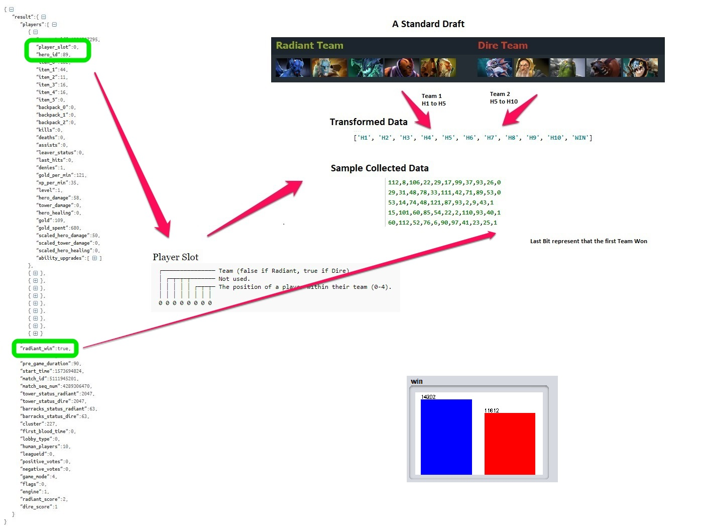
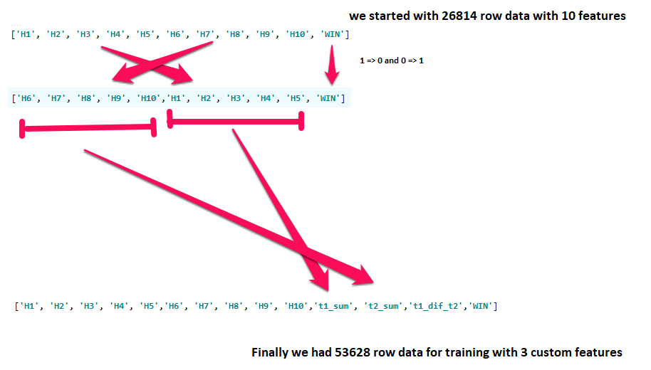
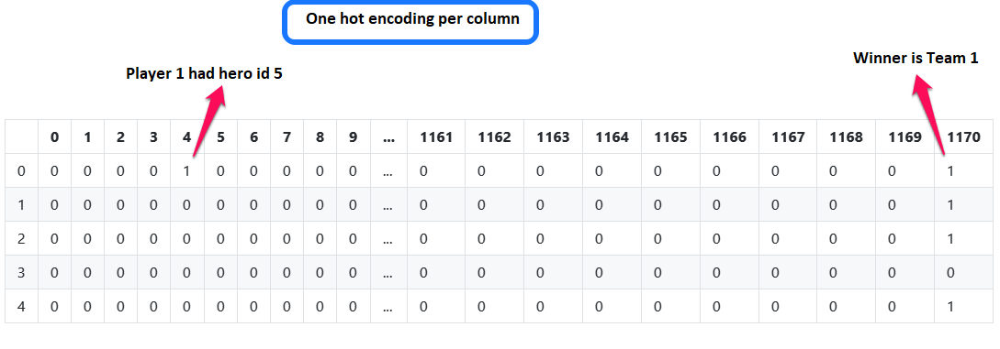
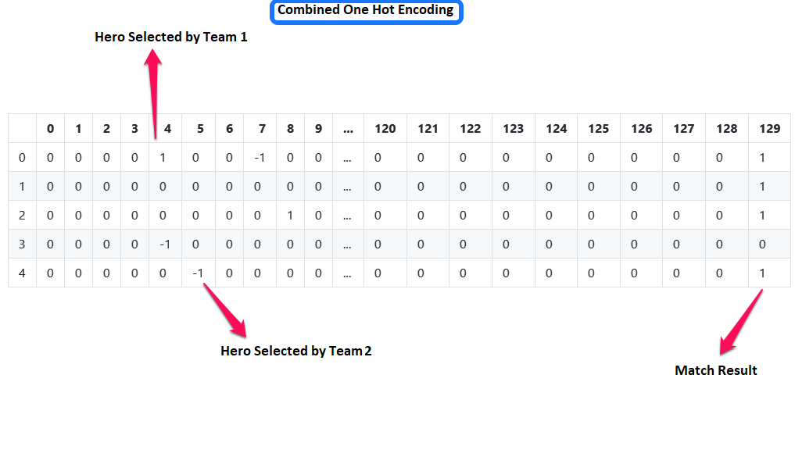
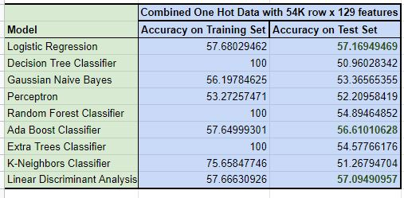
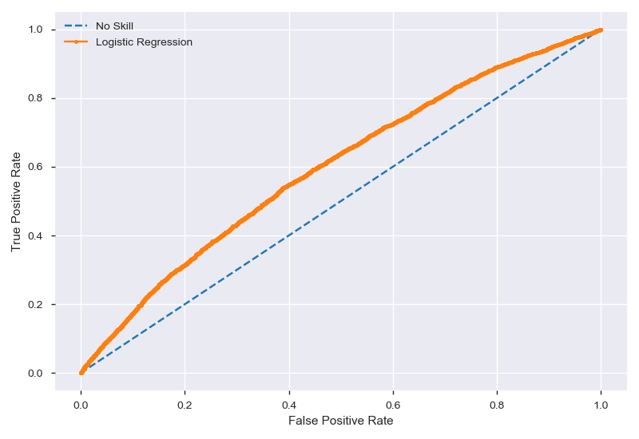
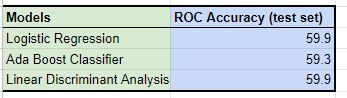
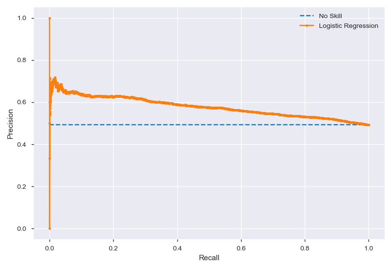

# Dota-2-Draft-Based-Win-Prediction

The goal of this project is to train a machine learning model to predict the winning team for
the popular online game Dota 2 as accurately as possible based on the selected heroes by both
teams at the start of their game. We collected data using the Stream API for recently played
matches and applied different machine learning models in our experiments to get the best win
predictor model. We have included all details including data collection, exploratory analysis,
feature selection, modeling, and results.

# Data Collection

# Create more data

# Features Engineering and training

# Results

